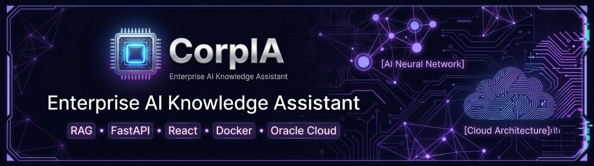
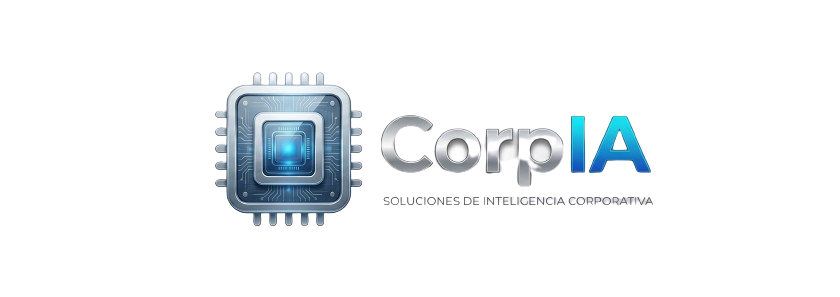
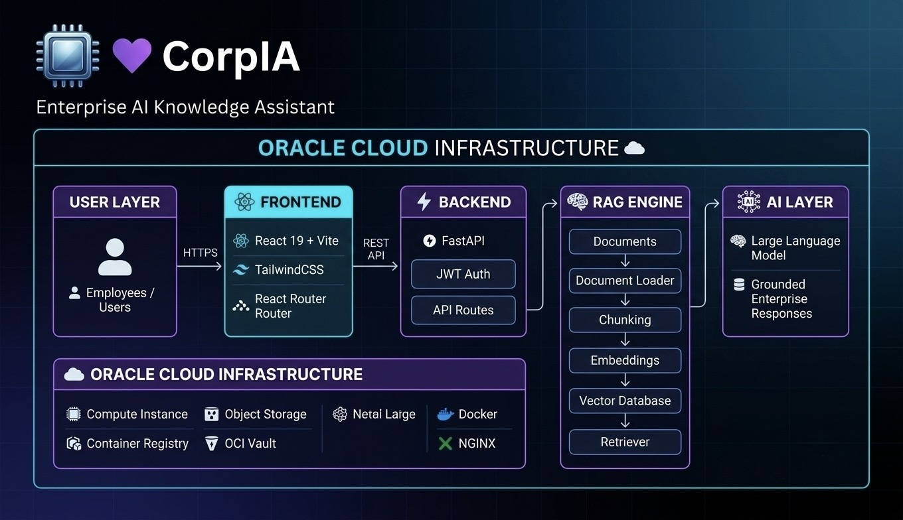
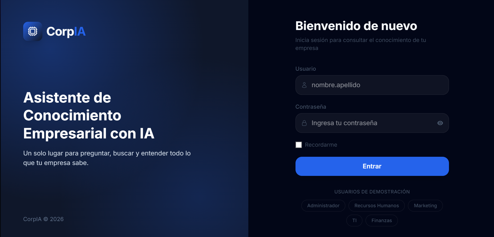
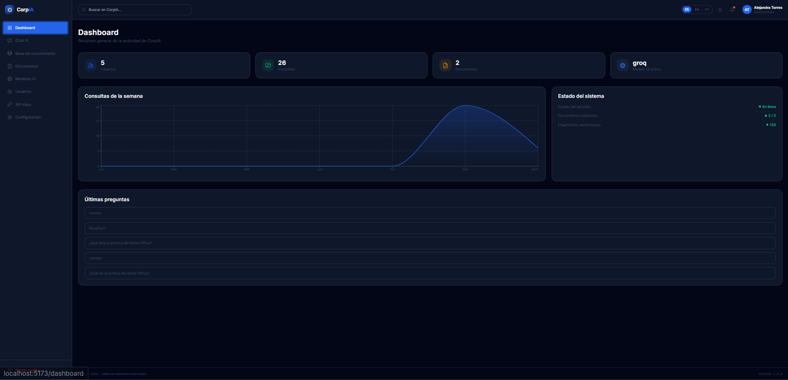
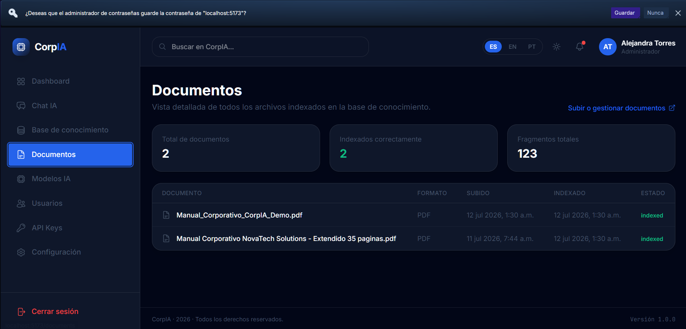
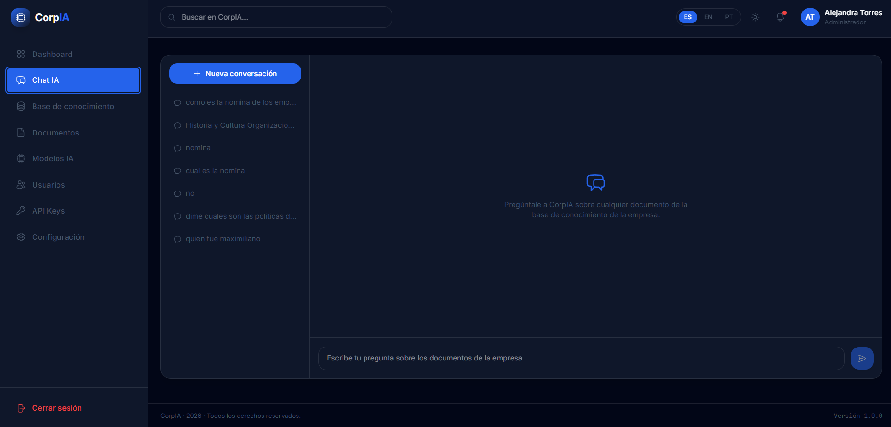

# 🚀 CorpIA — Plataforma Inteligente de Gestión Documental con IA

<!-- Banner -->

  

  <strong>CorpIA</strong> es una plataforma inteligente impulsada por IA diseñada para facilitar la gestión, análisis y consulta de información empresarial mediante una API moderna y una interfaz intuitiva.

<!-- Logo -->

  

---
<!--Demo-->

---

## ✨ Identidad Visual

CorpIA cuenta con una identidad visual enfocada en:

* 🤖 Inteligencia Artificial aplicada a procesos empresariales.
* 📂 Gestión inteligente de documentos.
* 🔐 Acceso seguro mediante autenticación.
* 📊 Visualización clara de información.
* ⚡ Arquitectura moderna preparada para escalar.

---

# 🏗️ Arquitectura del Sistema

<!-- Arquitectura -->

  

La arquitectura de CorpIA está diseñada bajo una estructura modular:

* 🖥️ **Frontend:** Interfaz de usuario para interacción con la plataforma.
* ⚙️ **Backend API:** Servicios inteligentes para procesamiento de solicitudes.
* 🧠 **Módulos IA:** Análisis y procesamiento de información.
* 🗄️ **Base de datos:** Almacenamiento estructurado de información.
* ☁️ **Cloud Deployment:** Preparado para ambientes productivos.

---

# 🎬 Demo del funcionamiento

<!-- Demo GIF -->

  

El GIF muestra el flujo principal de la plataforma:

1. Inicio de sesión.
2. Acceso al panel de control.
3. Gestión de documentos.
4. Interacción con la inteligencia artificial.
5. Respuesta del sistema.

---

# 📸 Capturas del Proyecto

## 🔐 Login

<!-- Login -->

  

---

## 📊 Panel de Control

<!-- Panel -->

  

---

## 📂 Gestión de Documentos

<!-- Documentos -->

  

---

## 💬 Chat Inteligente

<!-- Chat -->

  

---

# 📈 Estado del Proyecto

---

# 🌟 Próximas mejoras

* [ ] Integración completa del frontend React.
* [ ] Migración de SQLite a PostgreSQL.
* [ ] Implementación de almacenamiento documental avanzado.
* [ ] Mejoras del modelo de IA.
* [ ] Sistema de usuarios y roles empresariales.
* [ ] Monitoreo y métricas del sistema.

---

# 🧠 Filosofía CorpIA

> "Transformar información empresarial en conocimiento inteligente."

CorpIA representa la unión entre tecnología, automatización e inteligencia artificial para crear herramientas capaces de ayudar a las organizaciones a tomar mejores decisiones.

<!-- Logo -->

  

